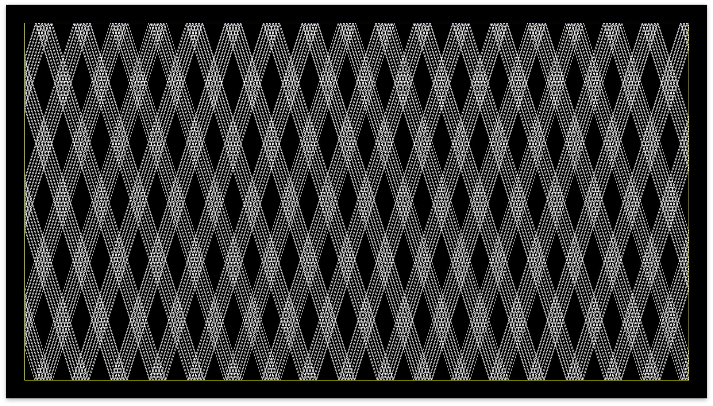

# Pathtrace

Pathtrace is a math art project that traces the path a ball/photon would take in 2D. It creates very pretty patterns. It is essentially a library for [Processing](https://processing.org/).

## Library

Pathtrace has a library that can be used with Processing! See `examples` to get an idea of how to use it.

As of this moment, the library does not have documentaiton. However inside the `src` file you will find the source code which is pretty well documented.